# Yet Another Supply Chain and Data Auditing

Ethereum Dapp for Tracking Items through Supply Chain

This repository containts an Ethereum DApp that demonstrates a Supply Chain flow between a Seller and Buyer and how to manage and audit blockchain product ownership as product is transferred down the supply chain. The user story is similar to any commonly used supply chain process. A Seller can add items to the inventory system stored in the blockchain. A Buyer can purchase such items from the inventory system. Additionally a Seller can mark an item as Shipped, and similarly a Buyer can mark an item as Received.

The DApp User Interface when running looks like this...

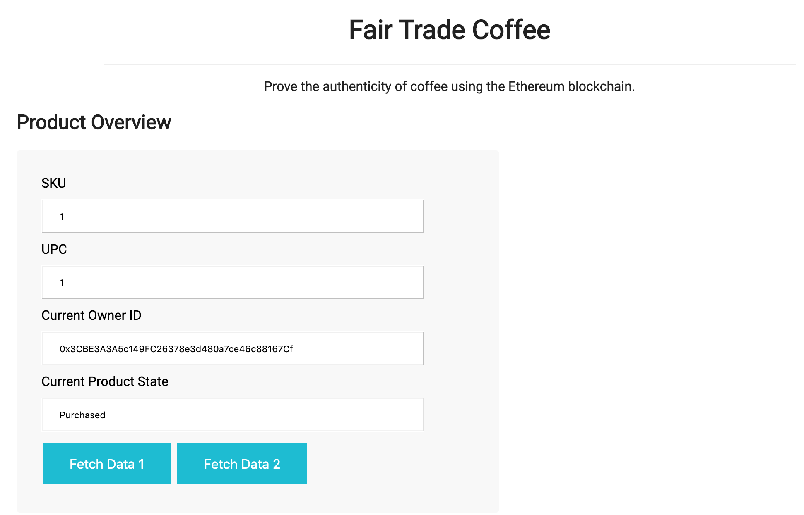


The deployed smart contract on Rinkeby Test net can be view at this [address](https://rinkeby.etherscan.io/address/0x505f5522dfed3a81436910358d63ef53ec1be01a) 

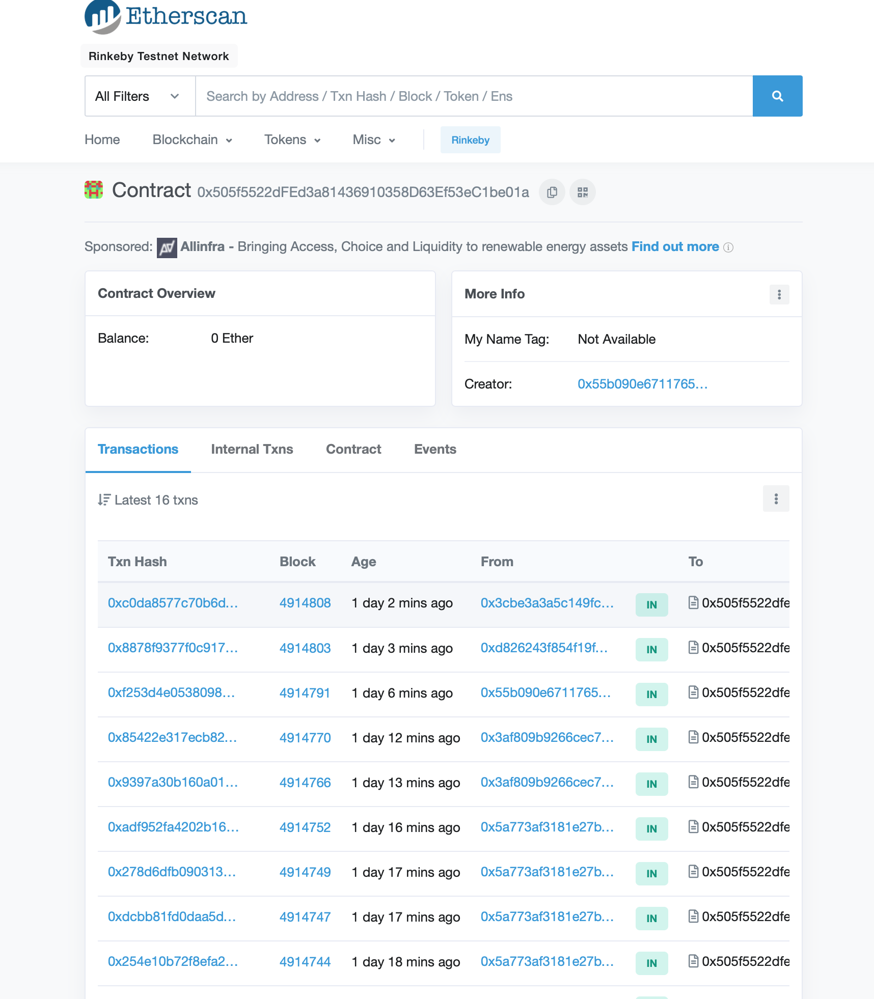 

## Design

Due to the cost and effort and challenges related to upgrading a smart contract, it is necessary to 
do some design thinking and planning upfront. This [ paper ](https://arxiv.org/pdf/1809.09596.pdf) is good resource about software engineering practices and using UML while designing Blockchain applications.

### Activity Diagram

The UML activity diagram captures the dynamic behavior of the system. It represents the flow 
from one activity to another in the system. We use the activity diagram to discover Actors and 
interactions in the supply chain.

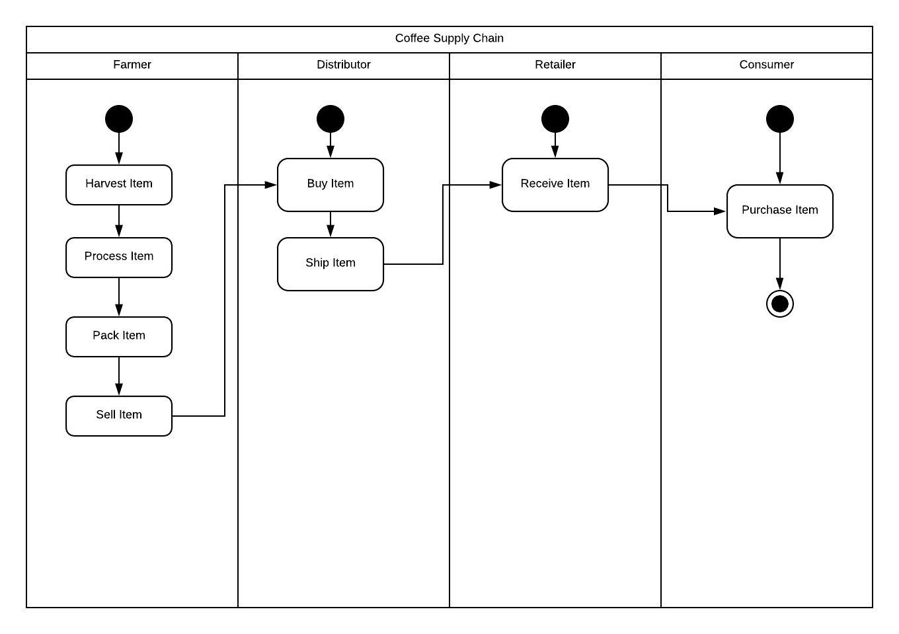

### Sequence Diagram

The sequence diagram is used to discover functions and events in the system It shows the interaction between
various objects in order of the sequence in which the interaction takes place. 

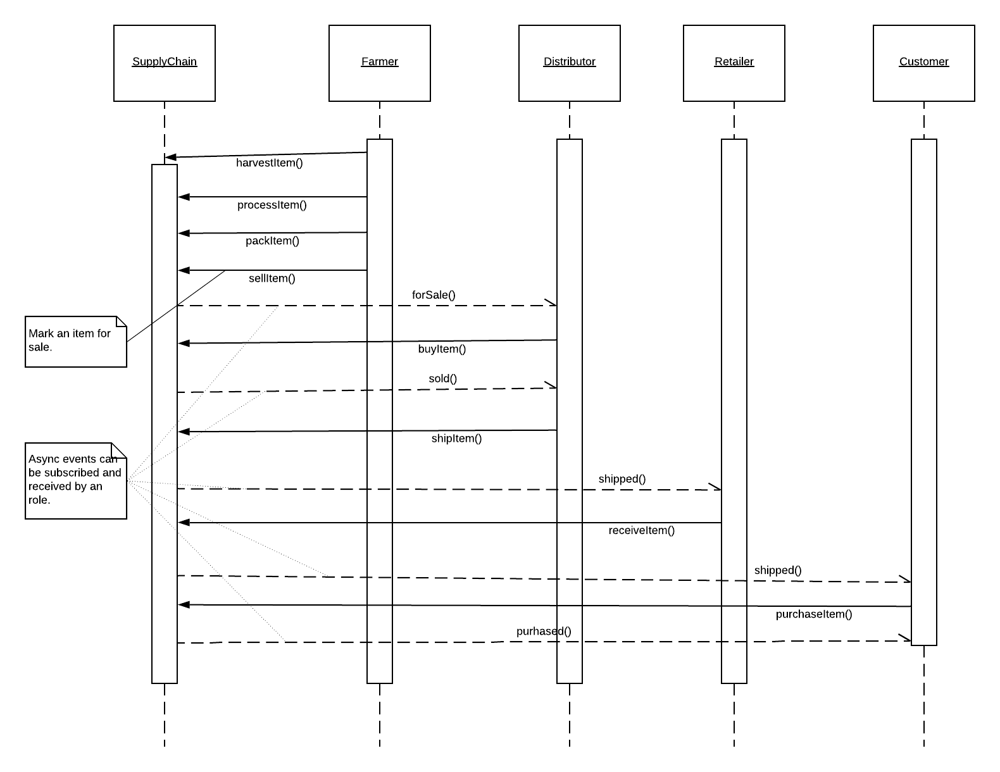

### State Diagram 

Shows the possible states the transition from one state to another. 

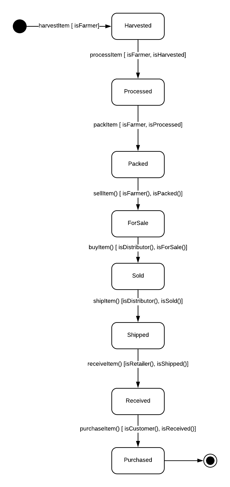

### Class Diagram

We use the class diagram to discover the data model. It models relationship and attributes of
the supply chain smart contract. 


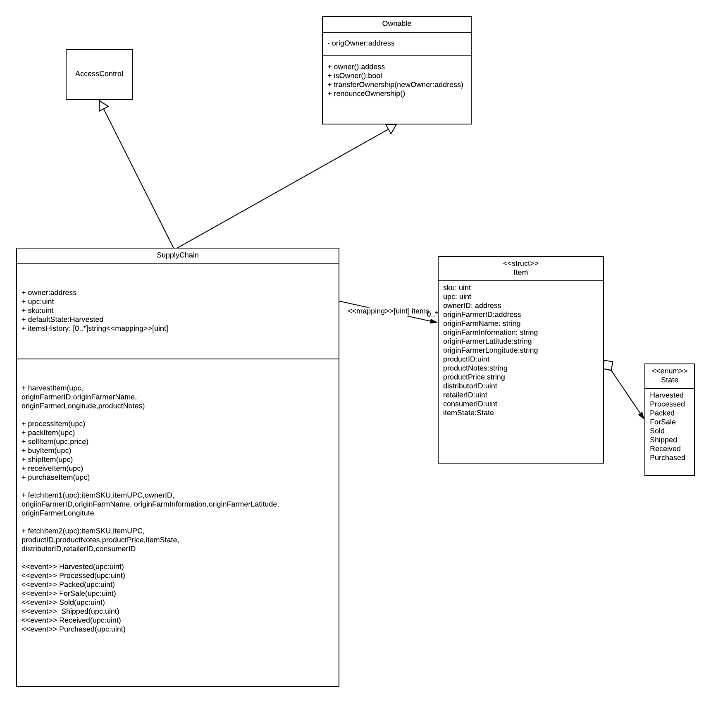


## Prerequisites

You must be familiar with the basic concepts and tools related to developing decentralized 
applications on Ethereum Blockchain.

1. Download and install [Node Version Manager]( https://github.com/nvm-sh/nvm#installation-and-update ) 
  (optional but highly recommended)

2. Download and install npm and [ nodejs ]( https://nodejs.org/en/ ). If you are using NVM, then 
  the latest version nodejs can be installed as: 
    ```
    nvm install node
    ```
3. Install [Ganache](https://www.trufflesuite.com/docs/ganache/quickstart)  development blockchain.

4. Install the command line version of Ganache as well.
    ```
    npm install -g ganache-cli
    ```

5. Install [Metamask](https://metamask.io/) Wallet for your browser. We will use Metamask wallet to sign
  transactions to be executed on our deployed contract on  Testnets (Rinkeby, Ropsten) and optionally on a local blockchain.
  If you already have a Metamask account, I recommend creating and using a *development* vault that
  doesn't have real Ether in yet. This way you won't accidentally lose any real money. You can always re-create/import your original wallet using the seed phrase/mnemonic of the wallet you created earlier.

  Unfortunately, Metamask doesn't provide an easy way to create a second vault if you already have one.The only
  way I know is to uninstall and reinstall Metamask. Once you have multiple vaults, switching between them
  is relatively painless by importing the account into Metamask using its seed phrase. 

  You can/should also import the accounts/vaults for your local Ganache blockchain using the seed phrase it
  emits when the local blockchain is started.

  By default there is only one account in the Metamask vault. Create at least five accounts by clicking on 
  the *Create Account* link in the Metamask window.

  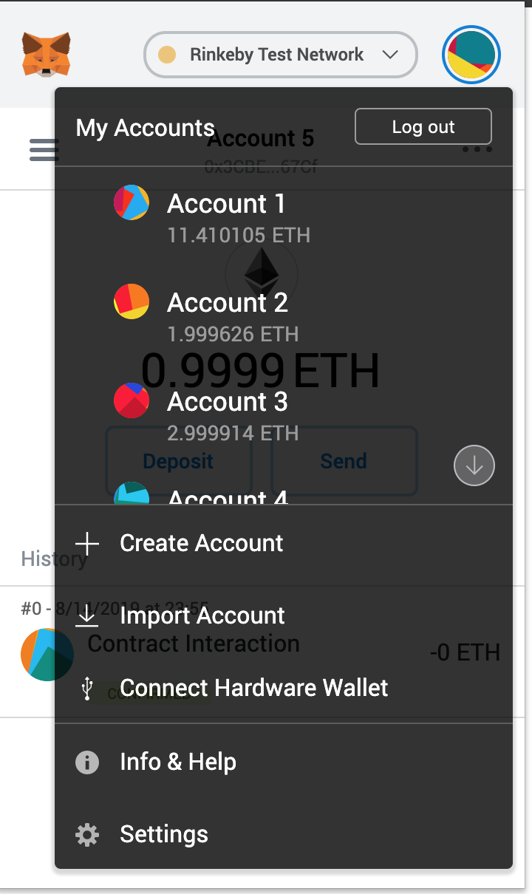

6. Request some test Ether funds from https://www.rinkeby.io/#faucet or from https://faucet.metamask.io. 
   Once you have some test Ether in your
   account make sure to distribute funds (at-least for some gas cost) to other accounts using 
   *Send Money* and then select *transfer between accounts* option in the Metamask window.

7. Create a free [Infura](https://infura.io) account if you don't have one already. Create a new Infura project or use an existing project. Note and copy the `PROJECT_ID`. The project id is 32 hexadecimal digits. 

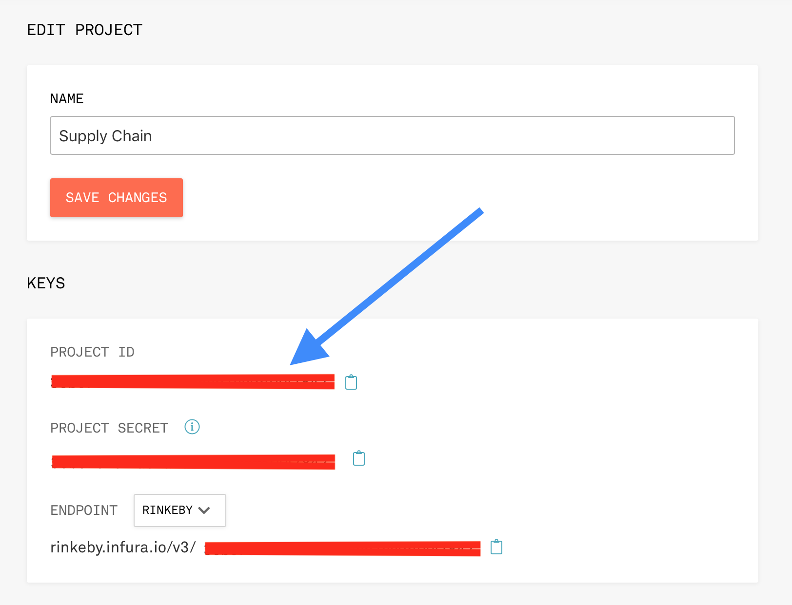


## Application Stack

This diagram shows high level stack layers of the supply chain distributed application. 

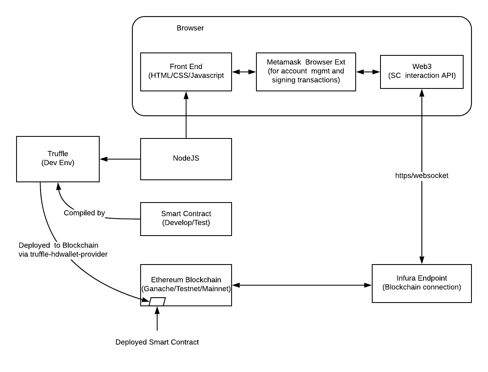

We compile/test/deploy our smart contract using truffle. For testing, we deploy the smart contract to a local
development version of Ethereum Blockchain (Ganache). To deploy the smart contract to the Rinkeby Testnet, we use trufle-hdwallet-provider.


## Getting Started

These instructions will get you a copy of the project up and running on your local machine for development and testing purposes. See deployment for notes on how to deploy the project on a live system.

- Clone this repository.
    ```
    git clone https://github.com/dkhroad-blockchain/eth-supply-chain
    ```

    The project directory structure is organized as the following: 

    - **`app/src:`**  UI client code (Javascript/ES6, HTML, CSS) 
    - **`contracts/coffeeaccesscontrol:`** Contract library code the provides roles (farmer,distributor etc.)
    - **`contracts/coffeebase:`**  Supply chain contract
    - **`contracts/cofeeecore:`**  Base contract that provides ownership functionality
    - **`build/contracts:`**  Contract JSON ABI to be used by the client app
    - **`test:`**  Mochajs based contract functionality tests
    - **`truffle-config.js`:** Truffle configuration file.
    - **`webpack.config.*.js`:** Webpack configuration files for dev/production enviornment
    - **`migrations`:** Directory for scriptable deployment files.
    - **`design:`** Supply chain contract UML artifacts
    - **`dist:`**  Webpack distribution output directory
    


- Install all requisite npm packages .
    ```
    npm install
    ```

## Smart Contract Development and Testing

- Launch Ganache UI or ganache-cli. 
  
  Ganache UI runs on port 7545 by default and Ganache CLI runs on port 8545. I prefer to use the UI version
  when doing interactive testing/debugging. Using the [workspace](https://www.trufflesuite.com/docs/ganache/workspaces/creating-workspaces) feature and [linking](https://www.trufflesuite.com/docs/ganache/truffle-projects/linking-a-truffle-project) your project is a great way to see more information about your smart contract. 

  For TDD workflow you can just the command line version of Ganache using either of the following commands.

  **NOTE**: If `truffle` is installed globally in your enviornment, you can skip the `npx` prefix shown in 
  the command line examples below.
    ```
    > ganache-cli 
   ``` 

  Regardless of what version of Ganache is used, the important thing to note is the mnemonic words and the
  port it is running. And make sure that your `truffle-config.js` file is updated to reflect that 
  configuration. 

- To compile smart contracts

    ```
    npx truffle compile
    ```

  This will create smart contract artifacts in ```build/contracts``.

  

- To test smart contracts: 
    * To the locally runnning blockchain - ganache-cli (port 8545):
      ```
      npmx truffle test 
      ```
    * To the locally runnning blockchain - Ganache UI  (port 7545):
      ```
      npx truffle test --network developui
      ```

    


## Deployment

### Local Deployment
- To migrate (deploy) the smart contract.
    * To the locally runnning blockchain - ganache-cli (port 8545):
      ```
      npx truffle migrate 
      ```
    * To the locally runnning blockchain - Ganache UI  (port 7545):
      ```
      npx truffle migrate --network developui
      ```


### Deployment on Testnet (Rinkeby)

Make sure you have completed steps #5 (Metamask) and #6 (Infura) of [Prerequisites](#Prerequisites)

Instead of installing a full Blockchain node, we will use Infura service to access Ethereum Testnet. 
Assuming you already have an Infura account, create a `.env` file in the root directory of your 
project and add your Infura project id to this file. The project id should look something like this `4a3e3a545bc78f561b4265546d58fbd0` (*this is not a real product id by the way :-)*).

```
PROJECT_ID=<your project_id>
```


In order to deploy our smart contract on a Testnet, Truffle needs to sign the transaction using the 
private key of account to be used for the deployment. Since we are not deploying the smart contract 
from a browser based tool such as Remix, we can't use Metamask to sign our contract deployment 
transaction. We need an another mechanism/tool tool sign the transaction from within Truffle. 
For this purpose, we will use `truffle-hdwallet-provider` wallet and import a account from Metamask.

Note that we will deliberately not import all Metamask accounts by providing the
vault's seed phrase. Instead, using the principal of least-privilege, we will only import
one account Metamask account into Truffle wallet using the account's private key.

To obtain a Metamask account's private key, follow the instructions provided
[here](https://metamask.zendesk.com/hc/en-us/articles/360015289632-How-to-Export-an-Account-Private-Key).

Add this private key to `.env` file. 

```
PROJECT_ID=<your project_id>
MNEMONIC=<private_key>
```
Make sure there enough Ether in this account for gas money needed to
execute contract deployment transaction. 

Now, to deploy your supply chain smart contract to Rinkeby Testnet, run the
following command.

```
npx truffle migrate --network rinkeby
```

## Usage

* Start the DApp client UI via webpack development server.

  ```
  npm run start 
  ```

### Add Roles

After deploying the supply chain contract, only admin (the account that deployed
the contract has all of the possible supply chain roles: Farmer, Distributor,
Retailer, and Consumer. In real scenario, different people/accounts will have
different roles. For the demonstration purposes, we will assign different roles
to different accounts. 

* Make sure, in Metamask Rinkeby network and the account that was used to deploy the 
smart contract is selected.

* Scroll down to the `Add Roles` section in the DApp UI. Add wallet addresses
    for different accounts in the form and click 'AddFarmer', 'AddDistributor',
    'AddRetailer', AddConsumer' buttons to add each role. Make sure all
    transactions occur in the admin account (by selecting 'Account 1') before
    triggering the transaction.

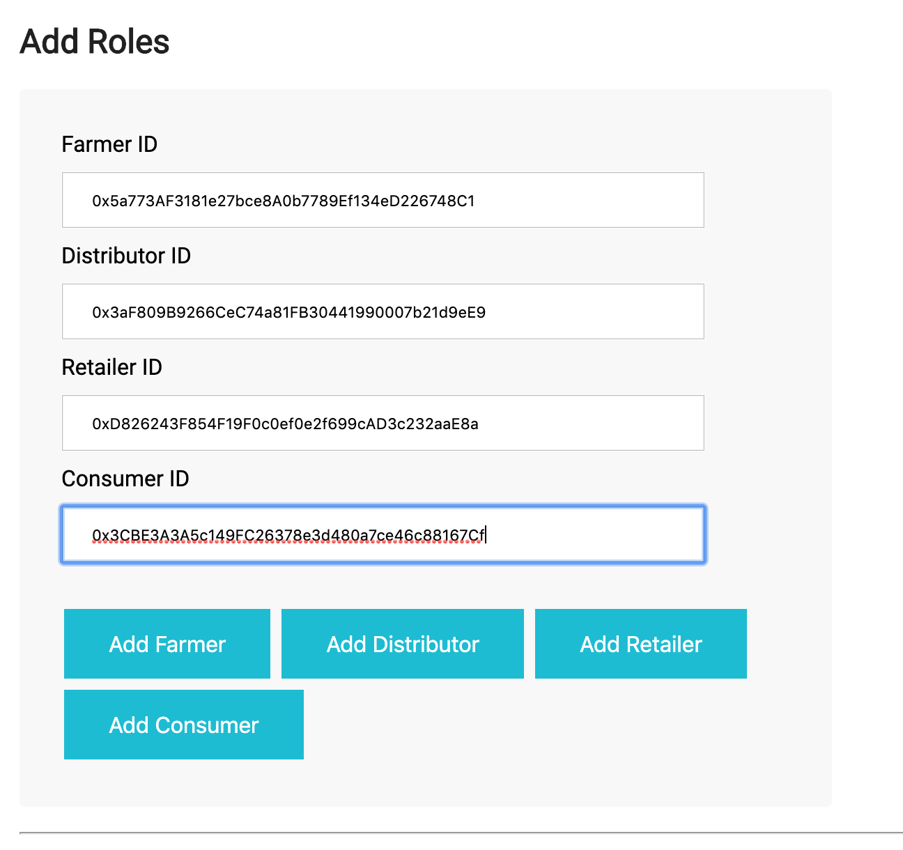

If everything worked as expected, you should be able to view the transaction ids in
the 'Transaction History' section. and accounts ids with roles in the 'Roles
History' section. 

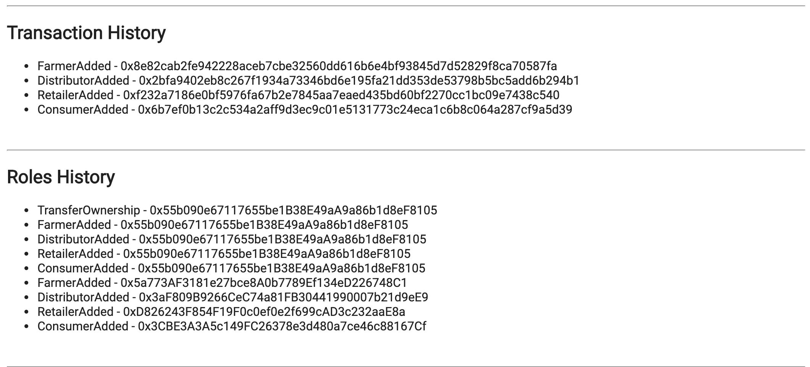

### Simulating the coffee supply chain item(s) flow.

Now you can move the items through the supply chain.

Select the account id chosen to be Farmer in the Metamask account to perform
'Harvest', 'Process', 'Pack' and 'ForSale' actions.

After each action, you can verify the current owner of the item and its state
by clicking 'Fetch Data 1' and 'Fetch Data 2' buttons.

Make sure account designated as the 'Distributor' role has enough Ether (item price + gas) 
buy the item from the farmer


## Issues

